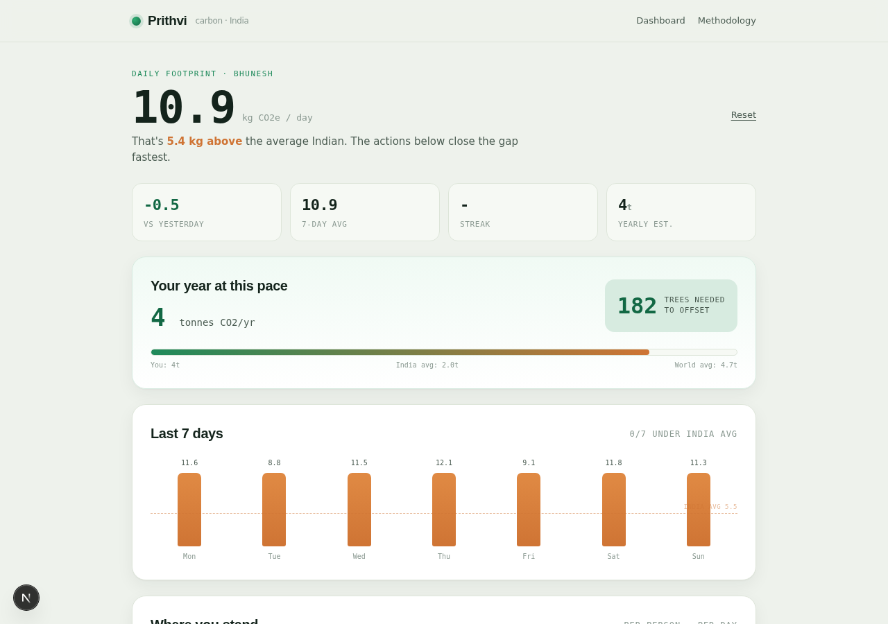
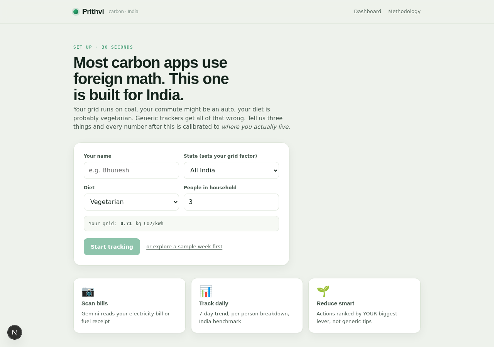
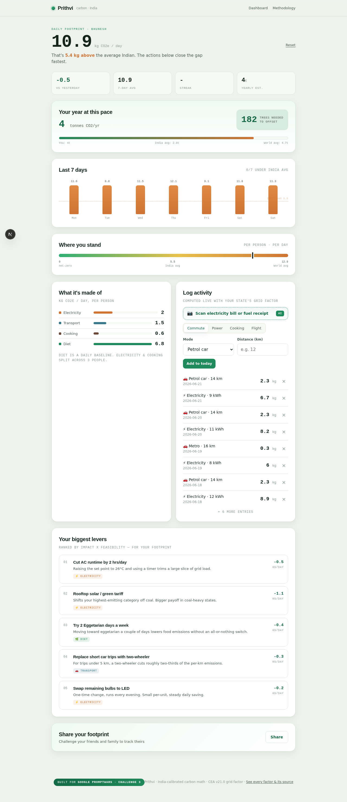
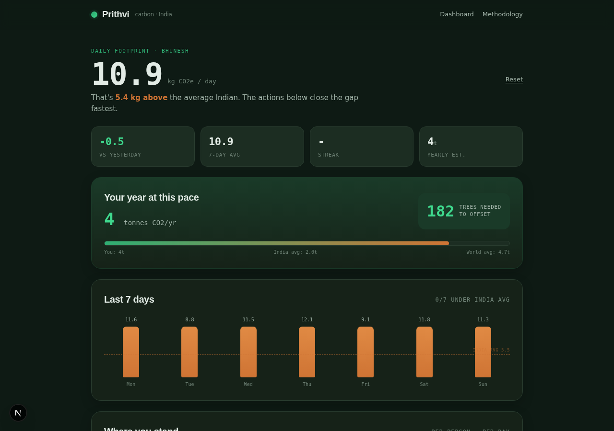
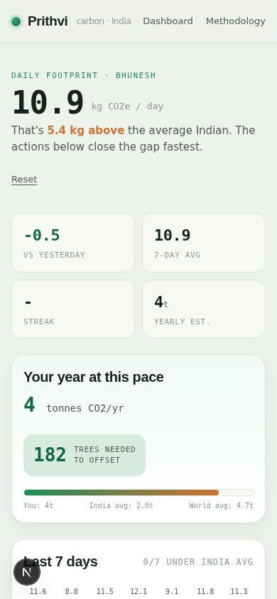
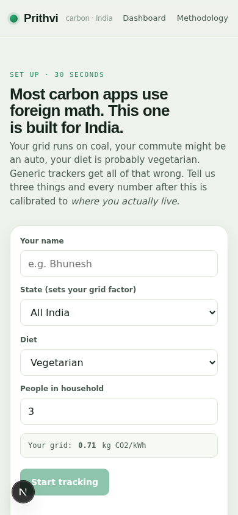
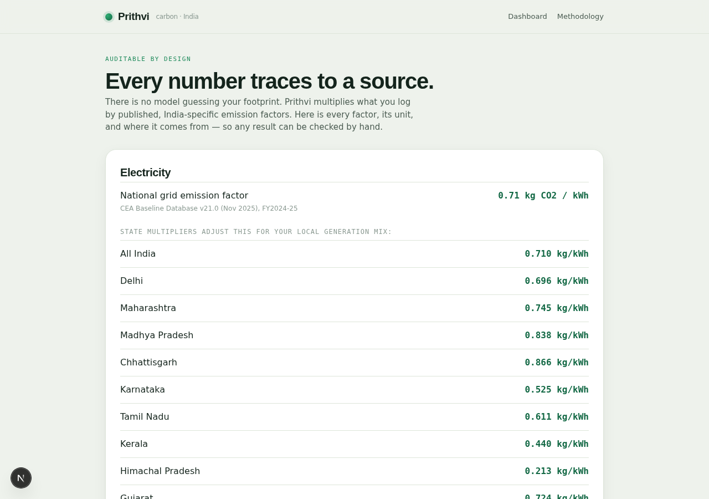

<p align="center">
  
</p>

<h1 align="center">Prithvi</h1>
<p align="center"><strong>Your carbon footprint, the Indian way.</strong></p>

<p align="center">
  <a href="https://prithvi-carbon.vercel.app"></a>
  
  
  
</p>

<p align="center">
  <em>Snap your electricity bill. Gemini reads it. Deterministic math does the CO2.<br/>
  No hallucinated carbon. Every number traceable to a published Indian source.</em>
</p>

<p align="center">
  
</p>

---

> **Google PromptWars - Challenge 3 - Carbon Footprint**
>
> *"Design a solution that helps individuals understand, track, and reduce their carbon footprint through simple actions and personalized insights."*

---

## Table of Contents

- [The Problem](#the-problem)
- [The Solution](#the-solution)
- [Screenshots](#screenshots)
- [How It Maps to the Brief](#how-it-maps-to-the-brief)
- [60-Second Demo Script](#60-second-demo-script)
- [Architecture](#architecture)
- [Security](#security)
- [Tests](#tests)
- [Emission Factors](#emission-factors)
- [Feature Highlights](#feature-highlights)
- [Run Locally](#run-locally)
- [Deploy to Vercel](#deploy-to-vercel)
- [Tech Stack](#tech-stack)
- [Built with Google Antigravity](#built-with-google-antigravity)

---

## The Problem

Every carbon tracker on the internet uses **Western emission factors**. They assume gas heating, American car fleets, and USDA diets. An Indian user gets numbers that are **fundamentally wrong** - your grid runs on coal, your commute might be an auto-rickshaw, your diet is probably vegetarian, and your cooking fuel is an LPG cylinder. Generic trackers get all of that wrong.

## The Solution

**Prithvi** is a carbon tracker built from the ground up for India.

```
You tell us three things:           We calibrate everything:
  1. Your state                       -> State-specific grid factor (CEA v21.0)
  2. Your diet                        -> Indian diet lifecycle emissions (ICAR-IARI)
  3. Your household size              -> Per-person splitting for shared resources
```

Then: **AI reads your documents, audited math calculates your CO2.**

> Gemini extracts numbers from your electricity bill or fuel receipt.
> It **never invents an emission figure**. Every kg of CO2 is computed by
> `lib/factors.ts` from published, India-specific factors. That separation
> is the credibility line.

---

## Screenshots

### Onboarding — India-calibrated setup in 30 seconds

<p align="center">
  
</p>

> State-specific grid factor preview, diet selection, household size — every number after this is calibrated to *where you actually live*.

### Dashboard — Your daily carbon footprint at a glance

<p align="center">
  
</p>

> 10.9 kg CO2e/day. 4-stat row (vs yesterday, 7-day avg, streak, yearly estimate). Annual projection with tree-offset count. 7-day trend chart with India-average dashed line.

### Full Dashboard — Breakdown, recommendations, activity log, sharing

<p align="center">
  
</p>

> Gauge (where you stand globally), category breakdown bars, personalized recommendations ranked by impact x feasibility, Gemini-powered bill scanner, activity log, and share card.

### Dark Mode — Full dark theme support

<p align="center">
  
</p>

> Complete dark mode via `prefers-color-scheme: dark`. Every component, card, chart, and gradient adapted.

### Mobile — Responsive, installable PWA

<p align="center">
  
  &nbsp;&nbsp;&nbsp;&nbsp;
  
</p>

> 2-column stat grid on mobile, 4-column on desktop. 44px touch targets, 16px inputs (no iOS zoom). Installable as a PWA from the home screen.

### Methodology — Every factor and its source

<p align="center">
  
</p>

> Transparent, auditable. Every emission factor linked to its published Indian source. No black boxes.

---

## How It Maps to the Brief

The challenge asks for three things. Prithvi delivers all three:

| Brief | Feature | How |
|---|---|---|
| **Understand** | India-calibrated math | CEA grid factors, ICAR diet data, ICCT transport - not US/EU defaults. Transparent `/methodology` page shows every factor and its source. |
| **Track** | Multi-modal logging | Manual entry + Gemini bill scanning. 7-day trend chart, 4-stat dashboard, annual projection with tree equivalence, streak gamification. |
| **Reduce** | Smart recommendations | Impact x feasibility engine ranks YOUR biggest levers first. Not generic tips - actions computed from your actual breakdown. |

---

## 60-Second Demo Script

> For judges evaluating the live app at [prithvi-carbon.vercel.app](https://prithvi-carbon.vercel.app)

| Step | What you see | Why it matters |
|---|---|---|
| 1. **Land** | Onboarding with state selector, diet picker, grid factor preview | Immediately signals: this is India-specific |
| 2. **Grid preview** | "Your grid: 0.866 kg CO2/kWh" with red "dirtier than average" tag | Real-time feedback before you even start |
| 3. **"Explore sample week"** | Instant dashboard with 7 days of realistic data, toast confirms | Zero friction to see the full product |
| 4. **Stats row** | 4 tiles: vs yesterday (-0.5), 7-day avg (10.9), streak (2d), yearly (4t) | Glanceable health metrics |
| 5. **Annual projection** | Bar chart: You vs India avg (2.0t) vs World avg (4.7t) + tree count | "You need 182 trees to offset" - visceral |
| 6. **7-day trend** | Colored bars with dashed India-average line, over/under coloring | Pattern recognition at a glance |
| 7. **Gauge** | Gradient track: net-zero -> India avg -> World avg, pin shows you | Where you stand globally, one visual |
| 8. **Breakdown** | Horizontal bars: Electricity, Transport, Cooking, Diet | See which category dominates |
| 9. **Biggest levers** | Ranked recommendations: "Cut AC by 2hrs" (-1.2 kg/day), "Metro 2x/week" (-0.8) | Not generic - computed from YOUR data |
| 10. **Scan** | Upload electricity bill photo -> Gemini reads kWh -> toast: "Found 214 kWh" | The AI moment |
| 11. **Share** | Tap Share -> native share sheet or clipboard | Viral loop |
| 12. **Dark mode** | Toggle system theme -> full dark UI | Polish |
| 13. **Mobile** | Open on phone -> responsive, installable PWA | Works everywhere |

---

## Architecture

```
                    ┌─────────────────────────────────────────┐
                    │              BROWSER (Client)            │
                    │                                         │
                    │  page.tsx                                │
                    │  ├── Onboarding (state/diet/household)  │
                    │  ├── Dashboard (breakdown + trend)      │
                    │  ├── Logger (manual + scan)             │
                    │  └── Recommendations (ranked actions)   │
                    │                                         │
                    │  lib/store.ts ←→ localStorage           │
                    │  lib/factors.ts (pure, deterministic)   │
                    │  lib/recommend.ts (impact × feasibility)│
                    └──────────────┬──────────────────────────┘
                                   │ POST /api/scan
                                   │ (image base64 + mime)
                    ┌──────────────▼──────────────────────────┐
                    │              SERVER (Node.js)            │
                    │                                         │
                    │  api/scan/route.ts                      │
                    │  ├── rate-limit.ts (12 req/min/IP)      │
                    │  ├── scan-schema.ts (Zod validation)    │
                    │  └── gemini.ts (API call, re-validate)  │
                    │                                         │
                    │  GEMINI_API_KEY (env var, server-only)   │
                    └──────────────┬──────────────────────────┘
                                   │ x-goog-api-key header
                    ┌──────────────▼──────────────────────────┐
                    │         Gemini 2.5 Flash                 │
                    │  "Read this bill, return JSON"           │
                    │  Response re-validated by Zod            │
                    └─────────────────────────────────────────┘
```

**Key design principle:** The AI reads documents. It never does math. All emission calculations are deterministic, pure functions with zero ML. This is the credibility line that makes the numbers auditable.

### File map

```
app/
  page.tsx              Client UI: onboarding, dashboard, logger, recommendations
  layout.tsx            Root layout with SEO meta, PWA manifest, nav
  globals.css           Full design system with dark mode
  methodology/page.tsx  Server-rendered factor table (auditable)
  error.tsx             Client error boundary
  api/scan/route.ts     Thin controller: rate-limit → validate → Gemini → respond

lib/
  factors.ts            Deterministic emission engine (pure, 0 dependencies)
  store.ts              Types, localStorage persistence, aggregation, demo seed
  recommend.ts          Impact × feasibility recommendation engine (pure)
  gemini.ts             The ONLY module that calls the Gemini API (isolated)
  scan-schema.ts        Zod contracts for input validation + output re-validation
  rate-limit.ts         Fixed-window rate limiter with periodic purge

tests/                  252 tests: unit, integration, edge cases, stress
public/                 PWA manifest, SVG icons, screenshots
```

---

## Security

This app handles user-uploaded images and calls a paid API. Security is not optional.

| Layer | Protection | Implementation |
|---|---|---|
| **API key** | Server-only, never in browser bundle | `process.env.GEMINI_API_KEY` in Node runtime, sent via `x-goog-api-key` header |
| **Input validation** | Every request Zod-validated | Base64 charset regex, 4.5 MB size cap, mime allowlist (jpeg/png/webp) |
| **Rate limiting** | 12 scans/min/IP, periodic purge | Fixed-window limiter with stale-entry cleanup to prevent memory leaks |
| **Output validation** | Gemini JSON re-validated | Strict Zod schema: enum detected types, non-negative numbers, max bounds |
| **Prompt injection** | Image text treated as data | Prompt instructs model to treat image content as untrusted data, not instructions |
| **Content-Type** | Enforced on API route | Returns 415 for non-JSON, 405 for GET, 400 for malformed body |
| **Headers** | Security response headers | `X-Content-Type-Options: nosniff`, `X-Frame-Options: DENY`, `Referrer-Policy` |
| **No secrets in source** | `.env.local` gitignored | `.env.example` documents setup without exposing values |

---

## Tests

```bash
npm test     # 252 tests, ~1.5s
```

**252 tests** across 11 test files covering every module:

| Category | Files | Tests | What's covered |
|---|---|---|---|
| **Unit** | `factors.test.ts`, `factors-exhaustive.test.ts` | 54 | Every transport mode, every diet, every state multiplier, boundary values, label completeness |
| **Unit** | `store.test.ts`, `store-exhaustive.test.ts` | 59 | All 5 activity types, household splitting, daily series, uid uniqueness, demo seed validation |
| **Unit** | `recommend-exhaustive.test.ts` | 19 | All 4 category thresholds, diet shifts for each level, scoring formula, cap at 5 |
| **Unit** | `rate-limit-exhaustive.test.ts` | 14 | Window expiry, remaining count, IP extraction from headers, stress (100 IPs) |
| **Unit** | `scan-schema-exhaustive.test.ts` | 33 | All valid/invalid request combos, result schema boundaries, stripDataUrl edge cases |
| **Unit** | `gemini.test.ts` | 19 | parseGeminiJson valid/invalid, markdown fences, unicode, GeminiError class |
| **Security** | `api.test.ts` | 18 | Input sanitization, XSS payloads, oversized images, mime injection, output re-validation |
| **Integration** | `integration.test.ts` | 25 | Full user journey, multi-profile comparison, annual projection math, share text generation |
| **Edge/Stress** | `edge-cases.test.ts` | 27 | Extreme numerics, 100+ activities, 365-day spans, rate limiter stress, schema boundaries |

A diet-recommendation direction bug was caught by these tests during development.

---

## Emission Factors

Every number in Prithvi traces back to a published source. No black boxes.

| Category | Factor | Unit | Source |
|---|---|---|---|
| Grid electricity | 0.71 | kg CO2/kWh | CEA Baseline Database v21.0 (Nov 2025, FY2024-25) |
| + State multipliers | 0.30x - 1.22x | relative | Himachal (hydro) to Chhattisgarh (coal) |
| LPG cylinder | 42 | kg CO2/cylinder | CarbonCrux India 2026 (14.2 kg domestic) |
| Petrol | 2.31 | kg CO2/litre | IPCC/DEFRA combustion factors |
| Diesel | 2.68 | kg CO2/litre | IPCC/DEFRA combustion factors |
| Petrol car | 0.155 | kg CO2/km | ICCT India mid-size average |
| Diesel car | 0.171 | kg CO2/km | India diesel car average |
| Two-wheeler | 0.050 | kg CO2/km | India 2W study |
| Auto-rickshaw | 0.107 | kg CO2/km | India CNG 3-wheeler EF |
| City bus | 0.030 | kg CO2/pkm | Urban bus per passenger-km |
| Metro | 0.018 | kg CO2/pkm | Electric metro, grid-adjusted |
| Local train | 0.012 | kg CO2/pkm | Indian Railways electric |
| Domestic flight | 0.133 | kg CO2/pkm | DEFRA short-haul domestic |
| EV car | 0.071 | kg CO2/km | 0.10 kWh/km x grid EF |
| Diet: Vegan | 3.0 | kg CO2/day | Plant-only, India lifecycle |
| Diet: Vegetarian | 4.6 | kg CO2/day | Lacto-veg, ICAR-IARI + CarbonCrux (~1.7 t/yr) |
| Diet: Eggetarian | 5.5 | kg CO2/day | Veg + eggs |
| Diet: Non-veg (light) | 6.8 | kg CO2/day | Chicken 2-3x/week |
| Diet: Non-veg (heavy) | 8.3 | kg CO2/day | Regular mutton/red meat (1.8x veg) |

**Benchmarks:** India avg = 5.5 kg/day (~2.0 t/yr) | World avg = 12.9 kg/day (~4.7 t/yr)

All factors are documented in-app at `/methodology`. Swap in newer CEA versions as published.

---

## Feature Highlights

| Feature | Detail |
|---|---|
| **Gemini bill scanning** | Upload electricity bill or fuel receipt photo, AI extracts kWh/litres |
| **State-specific grid** | 14 Indian states with CEA-sourced multipliers (Himachal 0.30x to Chhattisgarh 1.22x) |
| **4-stat dashboard** | vs yesterday, 7-day average, streak days under India avg, yearly estimate |
| **Annual projection** | Extrapolates daily footprint to tonnes/year with tree-offset equivalence |
| **Streak gamification** | Tracks consecutive days under India's average carbon footprint |
| **7-day trend chart** | CSS-only bar chart with dashed India-average line, over/under coloring |
| **Global gauge** | Gradient track from net-zero to world average with animated pin |
| **Smart recommendations** | Impact x feasibility ranked, category-specific, computed from YOUR breakdown |
| **Social sharing** | Web Share API with clipboard fallback, pre-composed share text |
| **Toast notifications** | Animated slide-up feedback on every action (add, scan, remove) |
| **Dark mode** | Full `prefers-color-scheme: dark` with adjusted color palette |
| **PWA installable** | Add to home screen on mobile, standalone display mode |
| **Mobile-first** | 44px touch targets, 16px inputs (no iOS zoom), responsive 2/4-col grids |
| **Accessible** | Skip-to-content link, semantic HTML, `prefers-reduced-motion` support |
| **Demo mode** | One-click sample week loads realistic data to explore the full dashboard |

---

## Run Locally

```bash
# Requirements: Node 18.18+ and npm
git clone https://github.com/bansalbhunesh/Prithvi_Carbon.git
cd Prithvi_Carbon
npm install
cp .env.example .env.local    # add your Gemini API key (optional)
npm run dev                    # http://localhost:3000
```

The app works fully without a Gemini key - bill scanning is disabled, everything else runs.

```bash
npm test                       # 252 tests, ~1.5s
npm run typecheck              # TypeScript strict mode
npm run build                  # production build (8.4 kB page JS)
```

---

## Deploy to Vercel

```bash
# 1. Push to GitHub
git push origin main

# 2. Connect repo in Vercel dashboard (auto-detects Next.js)

# 3. Add environment variable:
#    GEMINI_API_KEY = your Google AI Studio key
#    (Optional: GEMINI_MODEL, defaults to gemini-2.5-flash)
```

Zero config. No build settings needed. Vercel auto-deploys on every push.

---

## Tech Stack

| Layer | Technology | Why |
|---|---|---|
| **Framework** | Next.js 15.5 (App Router) | Server + client in one, Vercel-native |
| **UI** | React 19 + custom CSS | No component library overhead, full control |
| **Validation** | Zod 3.23 | Type-safe schemas for API boundaries |
| **AI** | Gemini 2.5 Flash | Fast, cheap, multimodal (reads bill photos) |
| **Testing** | Vitest 4.1 | Fast, ESM-native, 252 tests in 1.5s |
| **Deployment** | Vercel | Zero-config, edge network, env var management |
| **PWA** | Web manifest + SVG icons | Installable on mobile home screen |

---

## Built with Google Antigravity

Developed using Google Antigravity (PromptWars requirement). The agentic workflow scaffolded the Next.js app, built the deterministic emission engine from researched India factors, added the Gemini scan pipeline, and hardened the API route (validation, rate limiting, isolated service). Antigravity's AI Code Review was run in Security, Architecture, and Test modes before submission.

---

<p align="center">
  <strong>Prithvi</strong> - India-calibrated carbon math<br/>
  CEA v21.0 grid factor - ICAR-IARI diet data - ICCT transport factors<br/>
  <a href="https://prithvi-carbon.vercel.app/methodology">See every factor and its source</a>
</p>
